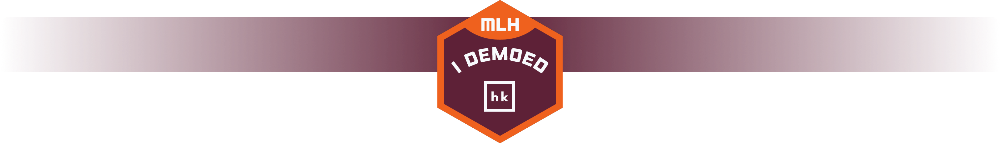
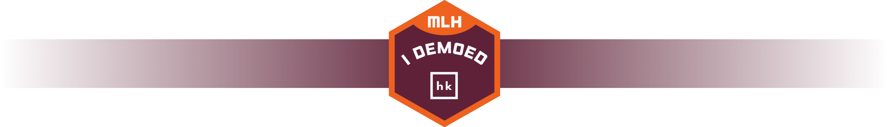
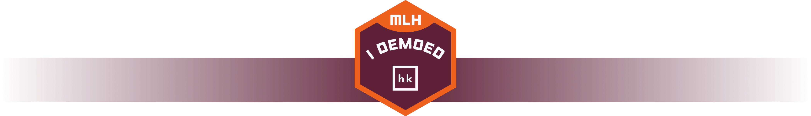

<!-- 
This repository is to show the cool project you created.
To make it easier to present, we created this sample, which you can edit and use for your HK project.
-->

  

&nbsp;

<!--
In the next part, we recommend displaying all important shields for your project: https://github.com/badges/shields
-->

  

A quick short description of what this project is about. It should be explained in
3 - 4 four sentences to catch the eye of the viewer of the Githu repository. 
It can contain some technologies, and what is the outcome of the project.

## Other Project repositories

<!--
If your project is constructed out of multiple Repositories, you can specify them here:
-->

## Documentation

<!--
Documentation is a crucial part of every project, but also maybe during the hackathon, you did not have time to create it. We recommend coming back later and filling in this part, for example, with https://docs.github.com/en/communities/documenting-your-project-with-wikis/about-wikis
-->

## Contributors ✨

Thanks go to these wonderful people
<!--
Here, you can show off all your cool teammates with whom you created this project.
If you want to automate it, you can use a cool bot: https://allcontributors.org/
-->

## License

<!-- You can use this section to specify the license for this project under which it can be distributed. -->

## Thanks

<!-- You can use this section to thank people who helped you create this awesome project outside of your team -->

